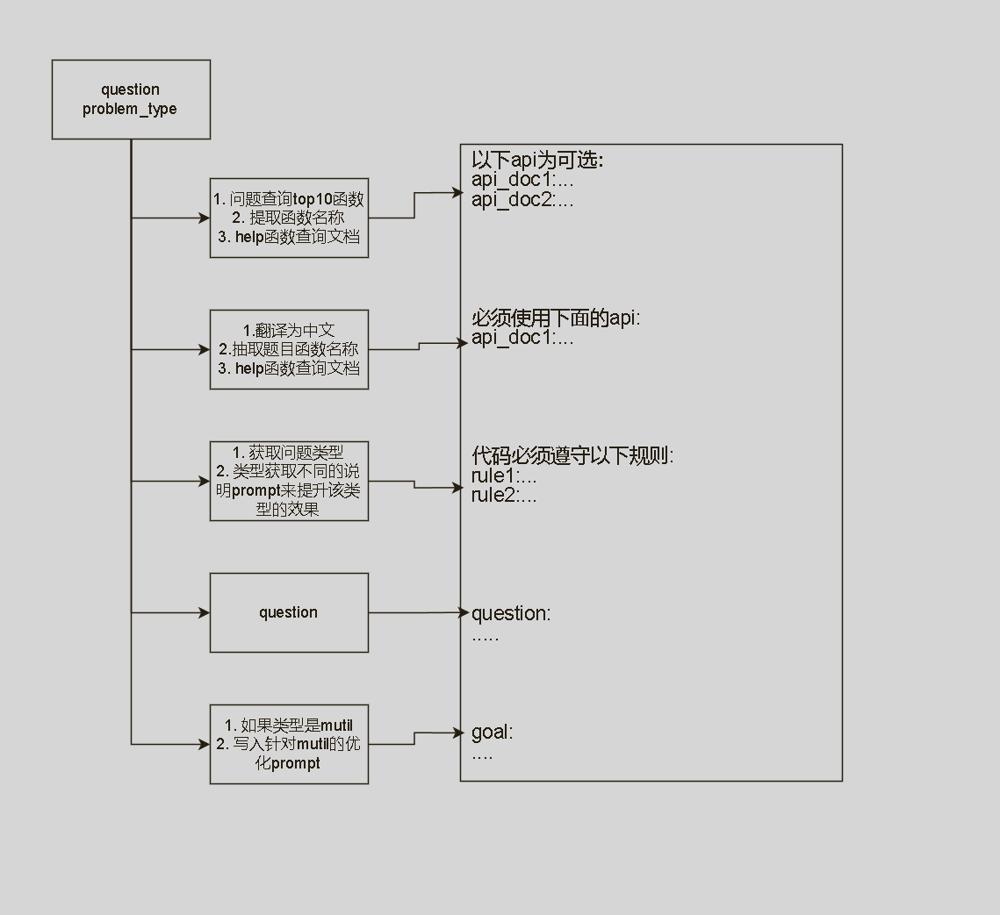
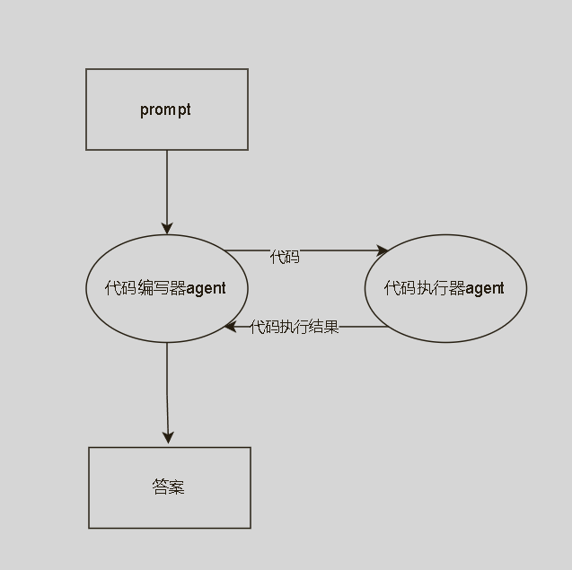

# SMP 2024大模型图分析挑战赛
此项目为Robo Space团队在[SMP 2024大模型图分析挑战赛](https://tianchi.aliyun.com/competition/entrance/532253)复赛的解决方案。

<div style="text-align: center;">

</div>

## 代码结构

```
项目根目录/
│
├── code/（llm生成的代码会放到这里，此目录也是运行生成的代码的工作目录）
│   ├── 7th_graders.gml（代码运行时所需的 gml 文件）
│   └── ...（其他相关的代码生成文件）
│
├── data/（存放相关文档、数据及中间结果、最终结果的目录）
│   ├── GraphPro-master/（API 文档文件夹）
│   │   ├── doc datasets/（API 文档中的数据集文件夹）
│   │   │   ├── cdlib.json（示例数据文件）
│   │   │   └── ...（其他文档和数据集）
│   ├── Final_TestSet/（测试集文件夹）
│   │   ├── data/
│   │   └── Final_TestSet.json (测试集问题)
│   └── ...（中间结果、最终结果）
│
├── tool/（工具类文件目录）
│   ├── langchain_tool.py（基于 LangChain 构建的工作流相关代码，主要是 prompt 和 runnable ）
│   ├── autogen_tool.py（此文件为 autogen 相关文件，主要为prompt和模型配置，主要在main.py里被使用）
│   └── rag_tool.py（RAG 工具，负责数据清洗、embedding、索引、查询等操作）
│
├── .env.template（环境变量模版文件）
│
├── data_search.ipynb（Jupyter Notebook，用于构建每个问题的 prompt，并写入文件）
│
├── main.py（主脚本，读取 prompt 文件，使用 autogen 进行 10 并发推理并生成答案）
│
├── requirements.txt
```

## 运行步骤
1. 创建环境并安装package
2. 从[页面](https://tianchi.aliyun.com/competition/entrance/532253/information)获取GraphPro-master.zip和Final_TestSet.zip，解压后放到项目的data目录下。
3. 从[页面](https://tianchi.aliyun.com/competition/entrance/532253/information)获取Final_TestSet.zip，解压后把data下所有文件（各种gml等文件）复制到项目的code目录下。
4. 把`.env.tamplate`重命名为`.env`，并填入gpt4o的密钥信息 
5. 运行`data_search.ipynb`文件，第一次运行时，会建立向量数据库。此文档会产生一个中间文件`data/id_and_content.json`。 
6. 运行`main.py`，读取中间文件，输出推理结果，到`data/SMP_answer.json`
7. 再次运行`main.py`，每次运行，`main.py`都会检查`data/SMP_answer.json`，并对因运行中断/网络超时等原因造成没有输出结果的问题，进行重新推理。

## 赛题理解
本比赛为api调用赛题，需要根据给定的问题，调用api，生成答案。包含以下特点：
1. 使用的gpt4o内包含比赛要求的api，但是对api的使用并不正确，时常会发生import错误，参数错误等。
2. 赛题使用1~2个核心api，且推理并不复杂。
3. 题目总是会明确指出使用的api名称，或是使用的算法名称。
4. 难以验证题目结果的正确性。
5. 比赛的文档和help函数的结果一直，可以直接使用help函数来获取文档。
所以根据比赛理解，使用RAG为主，推理为辅的策略。给gpt4o于准确，完整的prompt，希望gpt4o能一次性生成准确代码，而不是依靠之后的reflection。

## 程序架构
可以通过两个核心文件“data_search.ipynb”和“main.py”来理解整个程序。“data_search.ipynb”用于生成prompt，“main.py”用于推理和修复代码错误。
### data_search.ipynb

### main.py


## tricks
1. 在抽取题目的重包括的函数时，使用是voting，即多次查询，然后聚合结果，提升准确率。
2. 使用递归，可以查询函数在包中的位置，提取出函数完整的路径，就可以使用help函数。
3. 对于api文档，召回率比准确率更重要，引入无关文档，会提升tokens使用，但并不会影响code生成。
4. 使用框架自带的缓存，可以避免重复推理。