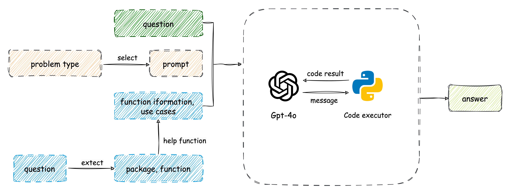

# SMP 2024大模型图分析挑战赛
此项目为Robo Space团队在[SMP 2024大模型图分析挑战赛](https://tianchi.aliyun.com/competition/entrance/532253)复赛的解决方案。

<div style="text-align: center;">

</div>

## 代码结构

```
项目根目录/
│
├── code/（llm生成的代码会放到这里，此目录也是运行生成的代码的工作目录）
│   ├── 7th_graders.gml（代码运行时所需的 gml 文件）
│   └── ...（其他相关的代码生成文件）
│
├── data/（存放相关文档、数据及中间结果、最终结果的目录）
│   ├── GraphPro-master/（API 文档文件夹）
│   │   ├── doc datasets/（API 文档中的数据集文件夹）
│   │   │   ├── cdlib.json（示例数据文件）
│   │   │   └── ...（其他文档和数据集）
│   └── ...（其他相关文档或中间结果、最终结果）
│
├── tool/（工具类文件目录）
│   ├── langchain_tool.py（基于 LangChain 构建的工作流相关代码，主要是 prompt 和 runnable ）
│   ├── autogen_tool.py（此文件为 autogen 相关文件，主要为prompt和模型配置，主要在main.py里被使用）
│   └── rag_tool.py（RAG 工具，负责数据清洗、embedding、索引、查询等操作）
│
├── .env.template（环境变量模版文件）
│
├── data_search.ipynb（Jupyter Notebook，用于构建每个问题的 prompt，并写入文件）
│
├── main.py（主脚本，读取 prompt 文件，使用 autogen 进行 10 并发推理并生成答案）
│
├── requirements.txt

```

## 运行步骤
1. 创建环境并安装package
2. 从[页面](https://tianchi.aliyun.com/competition/entrance/532253/information)获取GraphPro-master.zip，解压后放到项目的data目录下。
3. 从[页面](https://tianchi.aliyun.com/competition/entrance/532253/information)获取Final_TestSet.zip，解压后把data下所有文件（各种gml等文件）复制到项目的code目录下。
4. 把`.env.tamplate`重命名为`.env`，并填入gpt4o的密钥信息 
5. 运行`data_search.ipynb`文件，第一次运行时，会建立向量数据库。此文档会产生一个中间文件`data/id_and_content.json`。 
6. 运行`main.py`，读取prompt文件，输出推理结果，到`data/SMP_answer.json`
7. 再次运行`main.py`，每次运行，`main.py`都会检查`data/SMP_answer.json`，并对因超时/网络超时等原因造成没有输出结果的prompt，进行重新处理。